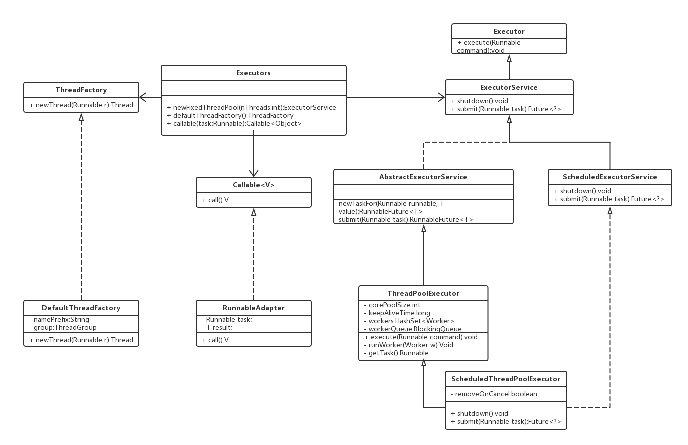
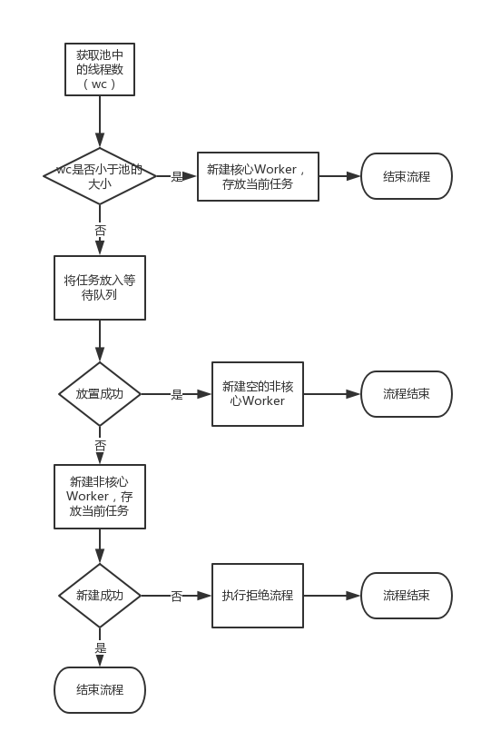

# Java 线程池
生活中，经常遇到“池”这个词，比如“水池”，“奖池”等。大致意思为“有好多____的地方”。

线程池，顾名思义，即“有好多线程的地方”。

> A thread pool is a collection of worker threads that efficiently execute asynchronous callbacks on behalf of the application.  ---msdn

> 翻译：线程是帮应用程序执行异步回调功能的一组工作线程

ThreadPoolExecutor 作为 Java 最核心的线程池工具，我们看下它是如何工作的。
# 类图

# 主要属性
```java
/** 超过核心线程数的请求放到等待队列里面 */
private final BlockingQueue<Runnable> workQueue;
/** 线程池的大小 */
private volatile int corePoolSize;
/** 线程池由HashSet保存，里面每个线程对应一Worker */
private final HashSet<Worker> workers = new HashSet<Worker>();
/** 是否允许空闲的线程执行超时释放 */
private volatile boolean allowCoreThreadTimeOut;
/** 空闲多久的线程算超时 */
private volatile long keepAliveTime;
/** 如果请求数超过等待队列长度，执行的拒绝策略(默认是直接丢弃)*/
private static final RejectedExecutionHandler defaultHandler = new AbortPolicy();
```
# Execute() 方法
## 源码--简化版

```java
public void execute(Runnable command) {
    int c = ctl.get();
    if (workerCountOf(c) < corePoolSize) {
        if (addWorker(command, true))
            return;
    }
    if (workQueue.offer(command)) {
            addWorker(null, false);
    }
    else if (!addWorker(command, false))
        reject(command);
}
```
## 流程图

## 分析
通过源码可知，executor() 方法中并没有明显的执行任务的痕迹，它做的事情很简单：
1. 如果池没满，就新建一个worker，把任务传过去
2. 如果池满了，就将任务扔到等待队列里去
3. 如果队列满了，就执行拒绝策略

那问题来了，任务到底是什么时候执行的呢，答案应该在 addWorker() 方法中

# addWorker() 方法

## 源码--简化版

```java
private boolean addWorker(Runnable firstTask, boolean core) {
    boolean workerStarted = false;
    boolean workerAdded = false;
  
    Worker w = new Worker(firstTask);
    final Thread t = w.thread;
    if (t != null) {
        try {
            int rs = runStateOf(ctl.get());
            if (rs < SHUTDOWN || (rs == SHUTDOWN && firstTask == null)) {
                workers.add(w);
                workerAdded = true;
            }
        } finally {
            mainLock.unlock();
        }
        if (workerAdded) {
            t.start();      // 重点关注
            workerStarted = true;
        }
    }
    
    return workerStarted;
}

// Worker 类，它也是Runnable 的一个实现
private final class Worker extends AbstractQueuedSynchronizer implements Runnable {
    Worker(Runnable firstTask) {
        this.firstTask = firstTask;
        this.thread = getThreadFactory().newThread(this);
    }
     public void run() {
        runWorker(this);
     }
}
```
## 分析
addWorker() 的处理流程：
1. 创建一个新的 Worker
2. 如果当前线程池运行正常，就将新 Worker 加入到线程池
3. 执行 Worker 的 start() 方法


这里我们能看出来，ThreadPoolExecutor 的执行原理是：
1. 维护一个 Worker 集合，作为线程池
2. 新任务过来后，新建一个 Worker， 把自己传给 Worker.thread, 把请求传给 Worker.firstTask
3. 然后调用 Worker.start()，因为 Worker 本身是 Runnable 的实现类，所以执行了 start() 后，jvm 会创建一个线程执行 worker.run()
4. 这样就达到了异步执行请求的目的

## 思考
那么问题来了，按照上面 execute() 的逻辑，如果任务过来时，没有空余线程给它用，它是直接进入到等待队列里的，那就没有触发 Worker.run()，
那等待队列里的任务是什么时候开始执行的呢？

# runWorker() 方法
## 源码--简化版
```java
final void runWorker(Worker w) {
    Thread wt = Thread.currentThread();
    Runnable task = w.firstTask;
    w.firstTask = null; 
    try {
        while (task != null || (task = getTask()) != null) {
             task.run();
        }
    } finally {
         processWorkerExit(w, completedAbruptly);
    }
}

```
## 分析
从上面的代码里可以看出来：
1. 在 jvm 新起线程执行 Worker.run() 的时候，首先被执行的是任务（task）的run() 方法
2. 在任务的 run() 方法执行完之后，它会继续去等待队列里面取新的任务执行，直到队列为空
3. 等到队列里的数据也执行完，它就执行 processWorkerExit() 方法销毁当前的 Worker

这种处理方式有几个好处：
1. 如果线程空闲了，就及时销毁掉，不占资源
2. 等下次新批次的任务过来了，直接复用前文逻辑：新建 worker，新起线程，执行当前任务和队列中的任务

## 思考
runWorker() 中，它获取不到任务时，立刻就关闭了当前线程

这种方式只能应对一下来了很多任务，接着闲置半天的情况

为什么就不能等一会儿呢？如果我的任务过来的时间稍微分散一点，那么每批数据过来都要重新建立线程池了

# getTask() 方法
## 源码--简化版
```java
private Runnable getTask() {
    boolean timedOut = false; // Did the last poll() time out?

    for (;;) {
        int c = ctl.get();
        int wc = workerCountOf(c);
        boolean timed = allowCoreThreadTimeOut || wc > corePoolSize;

        try {
            // 这段很重要
            Runnable r = timed ? workQueue.poll(keepAliveTime, TimeUnit.NANOSECONDS) : workQueue.take();
            if (r != null)
                return r;
        } catch (InterruptedException retry) {
            
        }
    }
}
```
## 流程图

## 分析
线程池的等待功能并非是在 runWorker() 中做的，而是放在去队列里拿任务（即：getTask()）时实现的
1
